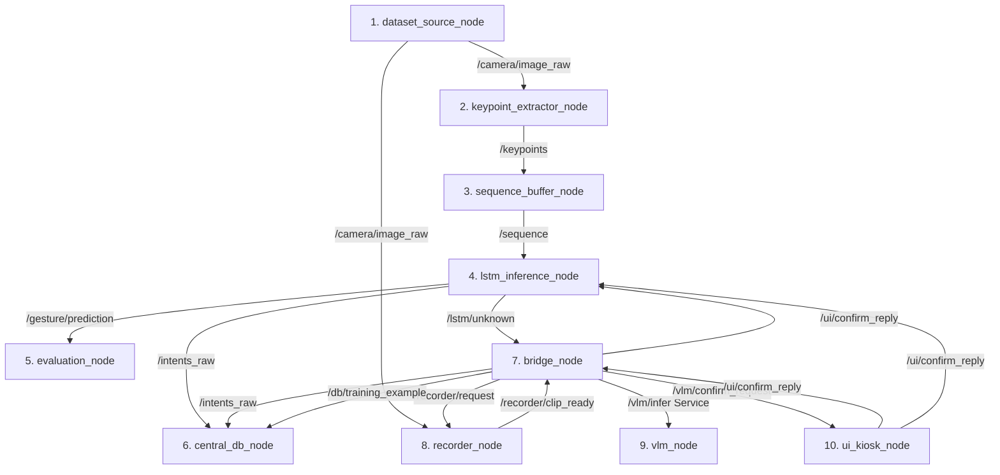

# ROS 2 Hybrid Gesture Recognition Pipeline: Structure & Flow

This document details the end-to-end architecture, codebase directory structure, message formats, and data flow logic of the 10-node hybrid gesture recognition pipeline. The system combines real-time lightweight deep learning (LSTM) for fast inference with large-scale vision-language modeling (FastVLM) and human-in-the-loop confirmation (UI Kiosk) for handling low-confidence scenarios.

---

## 1. System Architecture Overview

The system consists of 10 distinct ROS 2 nodes cooperating across standard publisher-subscriber topics, client-service calls, and isolated runtime environments:



---

## 2. Codebase Directory Structure

The hybrid workspace contains the following layout inside `/home/sayak/HybridTestBed`:

```text
/home/sayak/HybridTestBed
├── run_ros2_test.sh                  # Main launcher bash script
├── pipeline_structure_and_flow.md    # Architecture and flow documentation
├── hand_gesture_lab                  # Hand gesture training & preprocessing directory
│   ├── train.py                      # GestureLSTM model architecture and training loop
│   ├── preprocess_jester_v2.py       # Keypoint feature extraction on dataset
│   └── weights/                      # Model weights storage
│       └── best_lstm_model.pth       # Trained PyTorch LSTM weights file
└── gesture_ws                        # ROS 2 Humble workspace directory
    ├── build/                        # [Git Ignored] Built package build-artifacts
    ├── install/                      # [Git Ignored] Sourced environment installation files
    ├── log/                          # [Git Ignored] Colcon build and execution logs
    └── src/                          # Colcon source directory
        ├── amr_interfaces/           # Custom message packages for the robot/database
        ├── central_db_pkg/           # SQLite logging node package
        ├── data_source_pkg/          # Dataset player node package
        ├── evaluation_pkg/           # Real-time metrics sink package
        ├── keypoint_extractor_pkg/   # MediaPipe coordinate calculation package
        ├── lstm_inference_pkg/       # PyTorch LSTM inference engine package
        ├── ml-fastvlm/               # Vendorized FastVLM execution repository
        ├── sequence_buffer_pkg/      # Dynamic sliding window buffer package
        ├── ui_kiosk_pkg/             # Web server UI confirmation panel package
        ├── vlm_bridge_pkg/           # Pipeline coordinator state machine package
        ├── vlm_interfaces/           # Custom messages and services for VLM interaction
        ├── vlm_recorder_pkg/         # H.264 video recorder node package
        └── vlm_ros/                  # Apple FastVLM service node package
```

---

## 3. Node-by-Node Specifications

### 1. `dataset_source_node`
- **Package**: `data_source_pkg`
- **Publishers**: `/camera/image_raw` (`sensor_msgs/msg/Image`)
- **Logic**: Reads raw frames from simulated/real cameras or loops pre-recorded video sequences to emulate high-speed raw RGB input (~30 FPS).

### 2. `keypoint_extractor_node`
- **Package**: `keypoint_extractor_pkg`
- **Subscribers**: `/camera/image_raw` (`sensor_msgs/msg/Image`)
- **Publishers**: `/keypoints` (`vlm_interfaces/msg/KeypointsWindow` / `std_msgs/msg/Float32MultiArray` containing coordinate features)
- **Logic**: Operates MediaPipe Holistic pipeline. Tracks landmarks for hands and upper posture, normalizes coordinate values relative to a dynamic origin (midpoint between shoulders) to achieve translation invariance, and outputs a feature vector (length 144 coordinates).

### 3. `sequence_buffer_node`
- **Package**: `sequence_buffer_pkg`
- **Subscribers**: `/keypoints`
- **Publishers**: `/sequence` (`std_msgs/msg/Float32MultiArray` | size 8880: 30 frames x 296 dimensions)
- **Logic**: Maintains a sliding queue of length 30 (representing ~1 second of motion). Generates a 296-dimensional combined vector per frame comprising raw normalized coordinates, pairwise hand distances, and first-order temporal velocity vectors (differentials between $t$ and $t-1$). Flattens the final $30 \times 296$ window into a single array for publication.

### 4. `lstm_inference_node`
- **Package**: `lstm_inference_pkg`
- **Subscribers**:
  - `/sequence` (`std_msgs/msg/Float32MultiArray`)
  - `/ui/confirm_reply` (`amr_interfaces/msg/ConfirmReply`)
- **Publishers**:
  - `/gesture/prediction` (`std_msgs/msg/String`)
  - `/intents_raw` (`amr_interfaces/msg/Intent`)
  - `/lstm/unknown` (`amr_interfaces/msg/UnknownGesture`)
- **Logic**: Loads the trained PyTorch model `best_lstm_model.pth`. Generates softmax probabilities over the 6 target classes.
  - **High Confidence Gate ($>0.60$)**: Emits the label directly to `/gesture/prediction` and logs it to `/intents_raw`. Enters a short cooldown (`cooldown_known = 2.5`s) to prevent double activations.
  - **Low Confidence Gate ($\leq 0.60$)**: Intercepts classification, pauses the classifier (`paused = True`), publishes a trigger packet to `/lstm/unknown`, and locks the inference loop.

### 5. `central_db_node`
- **Package**: `central_db_pkg`
- **Subscribers**:
  - `/intents_raw` (`amr_interfaces/msg/Intent`)
  - `/db/training_example` (`amr_interfaces/msg/TrainingExample`)
- **Logic**: Subscribes to the raw classification telemetry and user confirmations. Inserts the session ID, timestamp, source (LSTM vs VLM+UI), labels, and associated video file path to the SQLite tables in `/home/sayak/amr_db/amr_gestures.db`.

### 6. `bridge_node`
- **Package**: `vlm_bridge_pkg`
- **Subscribers**:
  - `/lstm/unknown` (`amr_interfaces/msg/UnknownGesture`)
  - `/recorder/clip_ready` (`std_msgs/msg/String` - holds JSON filepath info)
  - `/ui/confirm_reply` (`amr_interfaces/msg/ConfirmReply`)
- **Publishers**:
  - `/recorder/request` (`vlm_interfaces/msg/RecorderRequest`)
  - `/vlm/confirm_request` (`amr_interfaces/msg/ConfirmRequest`)
  - `/vlm/call_start` (`amr_interfaces/msg/VlmCallStart`)
  - `/intents_raw` (`amr_interfaces/msg/Intent`)
  - `/db/training_example` (`amr_interfaces/msg/TrainingExample`)
  - `/ui/confirm_reply` (`amr_interfaces/msg/ConfirmReply` - fallback negative messages)
- **Service Clients**: `/vlm/infer` (`vlm_interfaces/srv/InferClip`)
- **Logic**: Implements the main state coordinator. Orchestrates sequence capture triggers, vision model async calls, timeout routines, and fallback error handlers to ensure the pipeline resumes immediately if any component crashes.

### 7. `recorder_node`
- **Package**: `vlm_recorder_pkg`
- **Subscribers**:
  - `/camera/image_raw` (`sensor_msgs/msg/Image`)
  - `/recorder/request` (`vlm_interfaces/msg/RecorderRequest`)
- **Publishers**: `/recorder/clip_ready` (`std_msgs/msg/String`)
- **Logic**: Implements a ring buffer cache of camera frames. On receiving a `RecorderRequest`, it captures $2$ seconds pre-trigger and $2$ seconds post-trigger frames. Writes the sequence using OpenCV (`mp4v` codec) to a raw temporary file, then automatically invokes `ffmpeg` to encode the clip to browser-native H.264 (`libx264` codec, `yuv420p` format) so the UI kiosk web panel can play the video.

### 8. `vlm_node`
- **Package**: `vlm_ros`
- **Services Provided**: `/vlm/infer` (`vlm_interfaces/srv/InferClip`)
- **Logic**: Runs in the isolated virtual environment `~/venvs/rosgpu_isolated` to bypass CUDA/Torch system package mismatches. Loads Apple's `FastVLM-1.5B` vision-language model. Processes the transcoded MP4 clip, analyzes the motion characteristics, and responds with a label guess, confidence score, and rationalization logic.

### 9. `ui_kiosk_node`
- **Package**: `ui_kiosk_pkg`
- **Subscribers**: `/vlm/confirm_request` (`amr_interfaces/msg/ConfirmRequest`)
- **Publishers**: `/ui/confirm_reply` (`amr_interfaces/msg/ConfirmReply`)
- **Logic**: Hosts an HTTP server on port `8008` serving a glassmorphic user interface. Displays live robot movements, shows the active VLM-transcoded video clip on uncertain gestures, and starts a countdown for human operators to Approve or Reject the candidate label.

### 10. `evaluation_node`
- **Package**: `evaluation_pkg`
- **Subscribers**: `/gesture/prediction` (`std_msgs/msg/String`)
- **Logic**: Sinks real-time system predictions directly into the terminal, monitoring active inference outputs.

---

## 4. Complete Execution & Data Flow Logic

### Scenario A: High-Confidence Known Gesture (e.g., Swipe Right at 93% Confidence)
1. **Raw Frames**: Streamed from `dataset_source_node` to `keypoint_extractor_node`.
2. **Features**: Coordinates extracted, buffered by `sequence_buffer_node`, and passed to `lstm_inference_node`.
3. **Inference**: LSTM predicts "Swipe Right" with $0.93$ confidence.
4. **Gate Bypass**:
   - Confidence ($0.93$) > Threshold ($0.60$).
   - Publishes `"Swipe Right"` to `/gesture/prediction` immediately.
   - Publishes an `Intent` record to `/intents_raw`.
   - Cooldown period (`2.5` seconds) initiated.
5. **Evaluation**: `evaluation_node` prints `Prediction Received: {"label": "Swipe Right", "confidence": 0.932}`.
6. **DB Storage**: `central_db_node` inserts the record into the `intents` database table.

---

### Scenario B: Low-Confidence / Unknown Gesture (e.g., Conf = 31%)
1. **Raw Frames**: Streamed from `dataset_source_node`.
2. **Inference**: LSTM predicts "Swipe Right" but with only $0.31$ confidence.
3. **Gate Trigger**:
   - Confidence ($0.31$) $\leq$ Threshold ($0.60$).
   - Classifier state changes: `paused = True`, `waiting_for_confirmation = True`.
   - Publishes `UnknownGesture` containing a new unique `session_id` (e.g. `sess_1780047309_4`) to `/lstm/unknown`.
   - `evaluation_node` prints `Prediction Received: {"label": "UNCERTAIN", "confidence": 0.314}`.
4. **Hold Activation**:
   - `bridge_node` intercepts `/lstm/unknown`, sets its state to `awaiting_clip`, and publishes a `RecorderRequest` to `/recorder/request`.
5. **Video Recording & Transcoding**:
   - `recorder_node` extracts the relevant 4-second segment from its frame cache.
   - Saves raw video file: `clip_sess_1780047309_4_0.mp4.raw.mp4`.
   - Runs background transcoder command:
     `ffmpeg -y -i raw.mp4 -vcodec libx264 -pix_fmt yuv420p final.mp4`
   - Publishes JSON details of the completed transcoded H.264 file to `/recorder/clip_ready`.
6. **VLM Execution**:
   - `bridge_node` receives `/recorder/clip_ready`.
   - Calls `/vlm/infer` service.
   - `vlm_node` processes the H.264 file and outputs the label prediction (e.g., `UNKNOWN` with confidence `0.60`).
   - `bridge_node` publishes a `ConfirmRequest` to `/vlm/confirm_request`.
7. **Human-In-The-Loop Confirmation**:
   - `ui_kiosk_node` receives `ConfirmRequest`. Sets internal state to active, rendering the clip path `/media/clip_sess_1780047309_4_0.mp4` on the webpage.
   - Web browser streams and plays the transcoded H.264 video.
   - Operator reviews the video and clicks **Approve** or **Reject**.
   - `ui_kiosk_node` publishes a `ConfirmReply` with `approved = True` (or `False`).
8. **Unpause & DB Storage**:
   - `lstm_inference_node` receives the `ConfirmReply`, sets `paused = False` and `waiting_for_confirmation = False`, immediately unblocking normal gesture predictions.
   - `bridge_node` receives `ConfirmReply` and logs the resolved `Intent` and `TrainingExample` (including raw video file path) to `/intents_raw` and `/db/training_example`.
   - `central_db_node` inserts the validated data into the SQLite database.
   - `bridge_node` resets its state machine for the next sequence.
9. **Timeout / Crash Fallback (Resiliency)**:
   - If VLM fails, times out, or the UI is ignored, the bridge's timer fires after `confirm_timeout_s` (20 seconds), triggering `reset_session()`.
   - `reset_session()` automatically publishes a negative `ConfirmReply` to `/ui/confirm_reply`.
   - `lstm_inference_node` intercepts this message, unpausing the pipeline immediately to prevent deadlocks.
