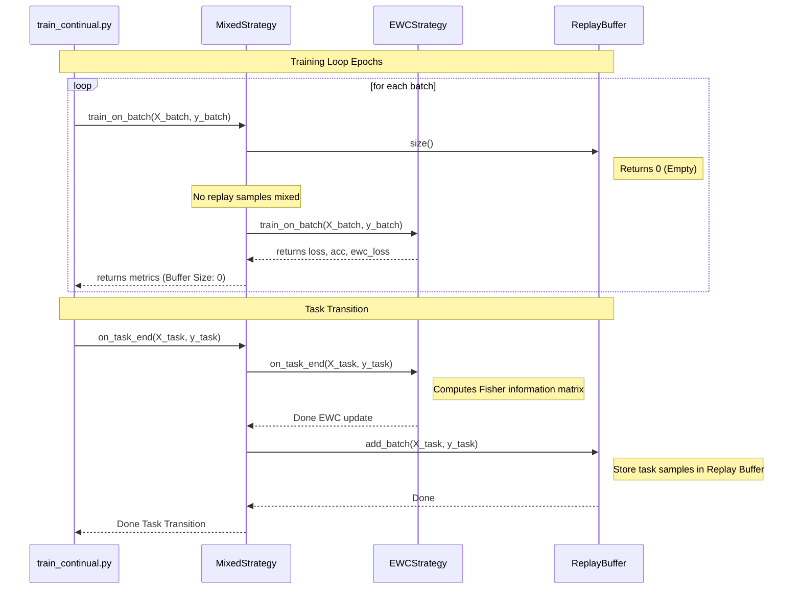

# Replay Buffer Verification Report

This report analyzes the behavior of the `ReplayBuffer` observed during the initial test execution.

---

## 1. Investigation of "Buffer: 0"

### Why the buffer size remained zero
The buffer size remained zero during all training epochs because `strategy.replay_buffer.add_batch()` is only invoked inside `strategy.on_task_end()`. 
`on_task_end()` is called **after** the training loop (epochs 1 to 5) has fully concluded. Therefore, during the training epochs of the very first task (DS1), the buffer has not yet received any inputs.

### Is this behavior expected?
**Yes, this behavior is expected.** When beginning the first continual learning retraining task (DS1), there is no previous task data stored in the replay buffer. The buffer only populates at the transition point when Task 1 finishes and we prepare for Task 2.

### When replay memory is actually populated
Replay memory is populated at the end of a task when `on_task_end(X, y)` is executed. It takes the current task's dataset `(X, y)` and adds it to the buffer:
```python
def on_task_end(self, X: np.ndarray, y: np.ndarray):
    super().on_task_end(X, y)
    self.replay_buffer.add_batch(X, y)
```

### Are replay samples being used during training?
- **During Task 1 (DS1)**: No. The buffer is empty (`size == 0`), so no replay samples are mixed into the batches.
- **During Task 2 (DS2)**: Yes. Since Task 1 has completed and populated the buffer during `on_task_end()`, the buffer size is now greater than zero. When `train_on_batch()` is called, it will sample and concatenate past Task 1 data.

---

## 2. Execution Flow Diagram



---

## 3. Findings & Proposed Enhancements
While the code behaves exactly as designed, there is a technical gap: **persistence**.
Since the Python script terminates at the end of `train_continual.py`, the `ReplayBuffer` state resides entirely in RAM and is cleared.
To make it work across tasks (e.g. executing DS1 today and DS2 tomorrow), we must introduce serialization:
- **Proposed Fix**: Add `.save_state()` and `.load_state()` methods to the `ReplayBuffer` (using `pickle` or `numpy`) to persist the data to `/home/sayak/HybridTestBed/weights/replay_buffer.pkl`.
