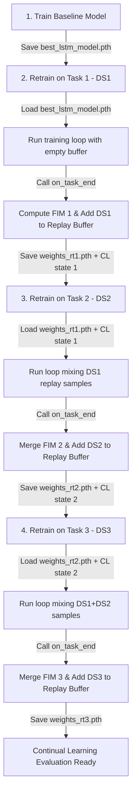

# Task Boundary Validation Report

This report evaluates how task transitions are managed across experiment stages.

---

## 1. Analysis of Task Transition Support

### Whether current code supports task transitions
**Partially.** The mathematical implementation (`MixedStrategy` and `EWCStrategy`) supports task transitions through running Fisher updates and replay memory aggregation. However, the execution runner (`train_continual.py`) does not support running task chains out-of-the-box because it lacks persistent serialization. If run sequentially as separate process invocations, the EWC Fisher importance weights and the Replay Buffer samples are reset.

### Whether `on_task_end()` is called at the correct moment
**Yes.** In `train_continual.py`, `on_task_end()` is executed immediately after the epochs of the retraining task are finished, which is the mathematically correct position.

### Whether Fisher updates occur after each task
**Yes.** When `on_task_end()` runs, it calls `EWCStrategy.on_task_end()`, which:
1. Backpropagates to compute empirical parameter gradients squared ($g^2$).
2. Aggregates these to estimate the Fisher Information Matrix (FIM).
3. Merges the new FIM with the running FIM using:
   $$F_{running} = \alpha F_{running} + (1 - \alpha) F_{new}$$
4. Updates the optimal parameters checklist ($\theta^*$).

### Whether replay memory persists across tasks
**No, currently it does not.** Because the script exits and memory is cleared, the replay buffer does not persist.
- **Fix**: Save `replay_buffer.pkl` and load it at the beginning of `train_continual.py`.

### Whether checkpoints are chained correctly
**Partially.** The script chains weights by reading from `model_path` and writing to `out_model_path`. However:
- EWC requires loading the previously saved optimal parameters ($\theta^*$) and Fisher matrices ($F_{running}$).
- If we only load model weights but do not reload `self.fisher` and `self.optpar` in `EWCStrategy`, the EWC loss penalty is calculated as zero, which disables EWC protection against forgetting.
- **Fix**: We must save the EWC state (Fisher + Optimal Parameters) along with the model weights.

---

## 2. Target Execution Sequence

To execute the experiment chain correctly, the sequence must run as follows:

---

## 3. Recommended Code Updates (To be implemented later)
We will add a helper function inside `train_continual.py` to serialize and deserialize the strategy state (Fisher, optpar, and ReplayBuffer) to `/home/sayak/HybridTestBed/hand_gesture_lab/weights/cl_state.pth`.
